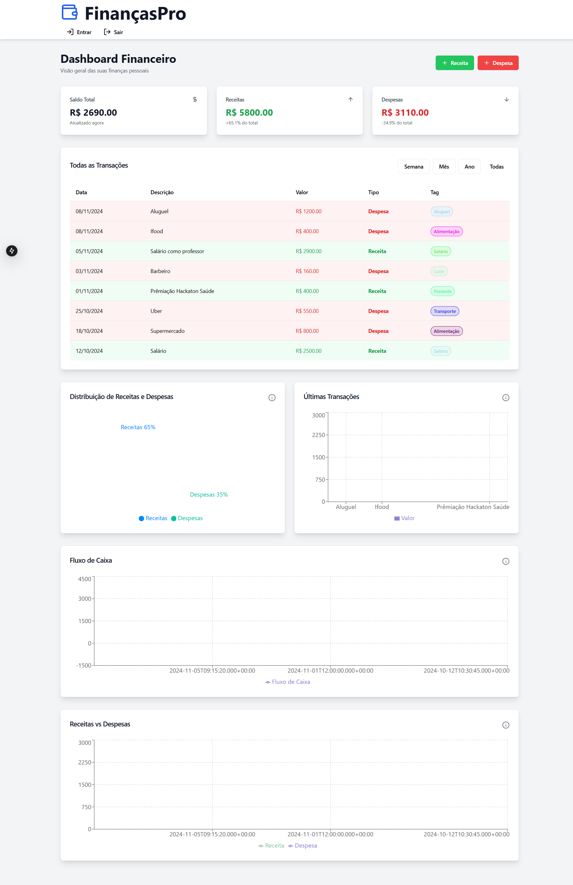

# Aplicativo de Controle Financeiro



## Descrição

Este é um aplicativo de controle financeiro desenvolvido com Next.js e TypeScript. Ele permite aos usuários gerenciar suas finanças pessoais, registrando receitas e despesas, visualizando saldos e analisando transações através de gráficos intuitivos.

## Tecnologias e Bibliotecas Utilizadas

- **Next.js**: Framework React para produção.
- **TypeScript**: Superset tipado de JavaScript.
- **React**: Biblioteca para construção de interfaces de usuário.
- **Tailwind CSS**: Framework CSS utilitário para estilização rápida.
- **shadcn/ui**: Componentes de UI reutilizáveis e acessíveis.
- **Radix UI**: Biblioteca de componentes primitivos para React.
- **Lucide React**: Conjunto de ícones para React.
- **Recharts**: Biblioteca de gráficos para React.
- **class-variance-authority**: Utilitário para criar variantes de componentes com classes.
- **zod**: Validação de formulários e componentes.
- **hookform**: Criação de componentes de formulários juntamente com o Reactjs.
- **clsx**: Utilitário para construir strings de classe condicionalmente.
- **tailwind-merge**: Ferramenta para mesclar classes Tailwind de forma eficiente.

## Funcionalidades

- Registro de receitas e despesas
- Visualização de saldo total
- Gráfico de barras para as últimas transações
- Tabela com todas as transações
- Interface responsiva e amigável para dispositivos móveis
- Modais para adicionar novas transações

## Como Iniciar

1. Clone o repositório:
   ```
   git clone https://github.com/JoaoIto/financeApp
   ```

2. Instale as dependências:
   ```
   npm install
   ```

3. Execute o servidor de desenvolvimento:
   ```
   npm run dev
   ```

4. Abra [http://localhost:3000](http://localhost:3000) no seu navegador para ver o aplicativo.

## Estrutura do Projeto

- `/components`: Componentes React reutilizáveis
  - `/ui`: Componentes de UI básicos (botões, inputs, etc.)
- `/lib`: Funções utilitárias e helpers
- `/pages`: Rotas e páginas do Next.js
- `/public`: Arquivos estáticos
- `/styles`: Estilos globais e configurações do Tailwind CSS

## Contribuindo

Contribuições são bem-vindas! Por favor, leia as [diretrizes de contribuição](./CONTRIBUTING.md) antes de submeter pull requests.

### Como posso contribuir?

- **Enviando Pull Requests**: Detalha o processo de como fazer contribuições de código.
- **Convenções de Código**: Garante que o código tenha um estilo consistente.

- **Melhorias e novas funcionalidades**: Sugerir novas funcionalidades que agregem ao projeto.

- **Revisão de Código**: Explica o processo de revisão, para que contribuidores saibam o que esperar.

Desenvolvido com ❤️ por [JoaoIto](https://github.com/JoaoIto) usando Next.js e TypeScript.


---
